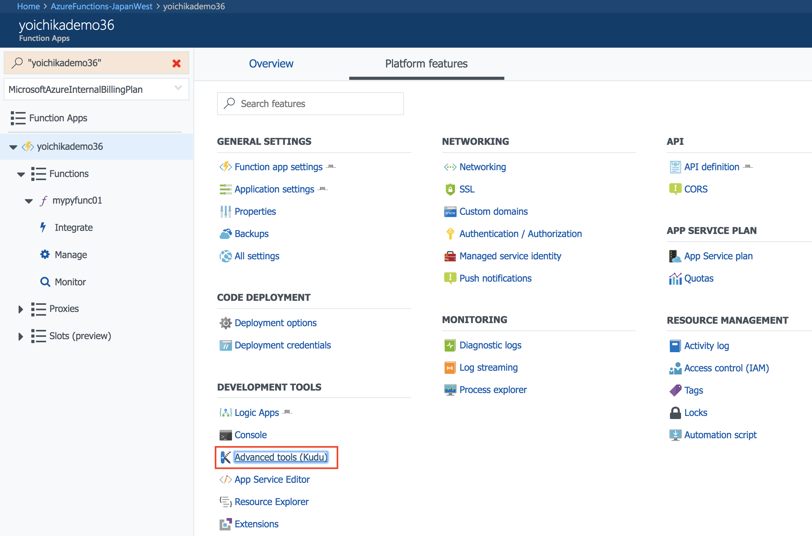
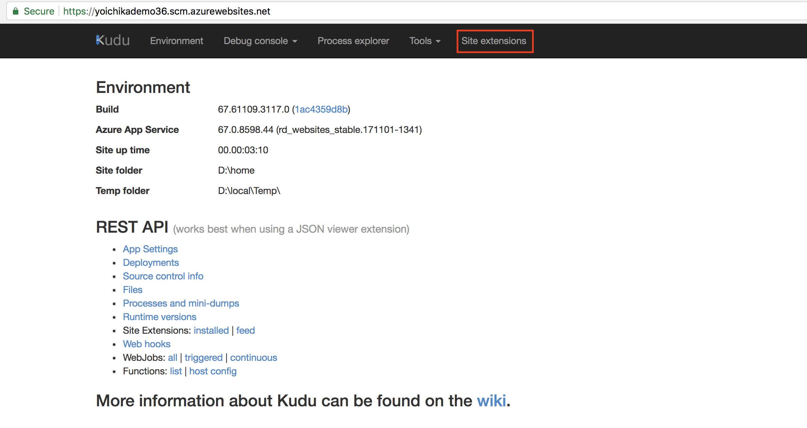
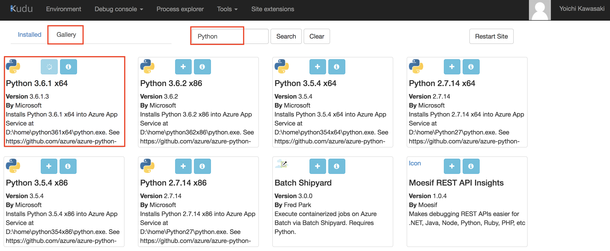
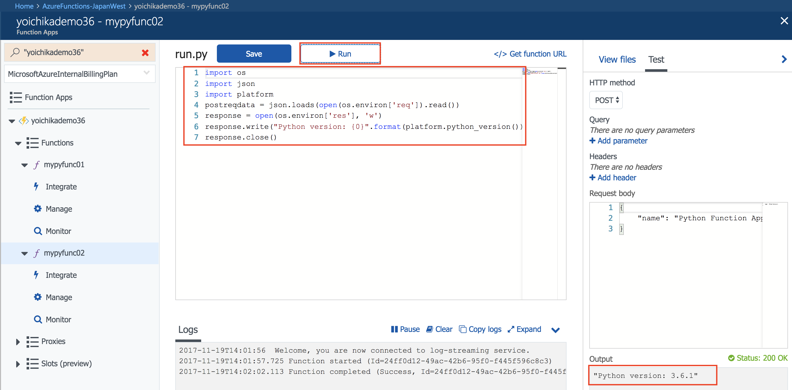

# How to change the Python version being used in a Function App

## 1. Create Function App (if you don't have the one yet)
Create a Function App in the Azure portal by following an article - [Create your first function in the Azure portal - Create a function app](https://docs.microsoft.com/en-us/azure/azure-functions/functions-create-first-azure-function#create-a-function-app) 

[note] Please make sure to choose **App Service Plan** for your Function App's Hosting plan.
From my experince, Custom Python runtime does always work under Consumption plan (Need to figure out the reason). For the difference between App Service Plan and Consumption plan, please refer to [Azure Functions hosting plans comparison](https://github.com/MicrosoftDocs/azure-docs/blob/master/articles/azure-functions/functions-scale.md)

## 2. Install Python 3.X x64 Site Extention in Kudu UI

In the Platform features page, click **Advanced tools (Kudu)** to go to Kudu UI. Or you can go to Kudo UI with the URL like **https://(your-function-app-name).scm.azurewebsites.net/**

In Kudu UI, click **Site extensions** to navigate you to Site Extensions page.

In Site Extensions page, select Gallery menu and typein **Python** as keyword for search box to get available Python runtimes modules, and install a 64 bit version of Python 3.5.4, Python 3.6.1, or whichever Python 3.X module available. In this case, Python 3.6.1 was chosen and installed in D:\home\python361x64


## 3. In App Settings, add Handler Mappings entry so as to use Python3.X via FastCGI

In App Settings page, scroll down to "Handler Mappings" section, and Add new handler mapping like this:

Suppose you installed Python 3.6.1 x64:

| Key | Value
| ------------- | ------------- | 
| Extension | fastCgi | 
| ScriptProcessor | D:\home\python361x64\python.exe | 
| Arguments | D:\home\python361x64\wfastcgi.py | 

Suppose you installed Python 3.5.4 x64:

| Key | Value
| ------------- | ------------- | 
| Extension | fastCgi | 
| ScriptProcessor | D:\home\python354x64\python.exe | 
| Arguments | D:\home\python354x64\wfastcgi.py | 

## 4. Test the python version beging used in Function App
Add a new function and add sample code like the following to see which Python version is being used in the Function App:
```
import os
import json
import platform
postreqdata = json.loads(open(os.environ['req']).read())
response = open(os.environ['res'], 'w')
response.write("Python version: {0}".format(platform.python_version())) 
response.close()
```

